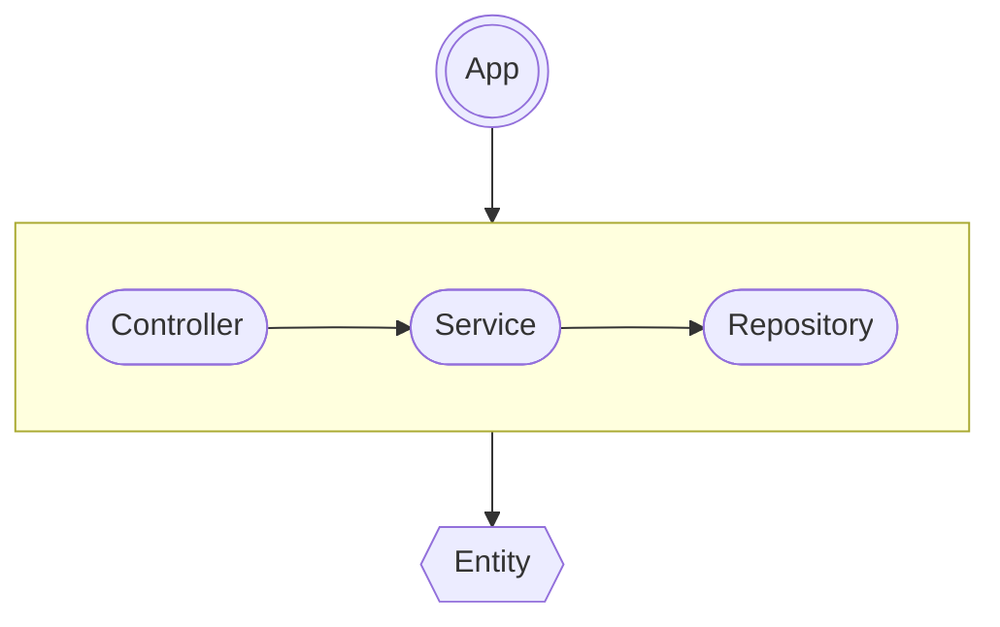

URL-сокращатель – учебный проект/сервис, предназначенный для генерации коротких ссылок.
Пользователи могут создавать, сохранять и удалять короткие ссылки.
Удаление ссылки возможно только для того пользователя, который ее создал.

## Запуск

Сервис поддерживает три варианта хранилища: in-memory, file и PostgreSQL.
Для запуска проекта с определенным хранилищем достаточно воспользоваться командой make.

##### Первый запуск `PostgreSQL` в `Prod` режиме

```bash
# установка зависимостей
make install-deps

# запуск PostgreSQL docker контейнера
make start-psql

# генерация сертификатов
make gen-cert

# запуск сервиса с http контроллером
make start-http-prod
# запуск сервиса с grpc контроллером
make start-grpc-prod
```

##### Первый запуск `PostgreSQL` в `Dev` режиме

```bash
# установка зависимостей
make install-deps

# запуск PostgreSQL docker контейнера
make start-psql

# генерация сертификатов
make gen-cert

# запуск сервиса с http контроллером
make start-http-dev-psql
# запуск сервиса с grpc контроллером
make start-grpc-dev-psql
```

##### Первый запуск `file` в `Dev` режиме

```bash
# установка зависимостей
make install-deps

# генерация сертификатов
make gen-cert

# запуск сервиса с http контроллером
make start-http-dev-file
# запуск сервиса с grpc контроллером
make start-grpc-dev-file
```

##### Первый запуск `In-memory` в `Dev` режиме

```bash
# установка зависимостей
make install-deps

# генерация сертификатов
make gen-cert

# запуск сервиса с http контроллером
make start-http-dev-mem
# запуск сервиса с grpc контроллером
make start-grpc-dev-mem
```

##### Переменные окружения и фраги необходимые для запуска через `go run`

Помимо инструкций, запуск сервера через `go run cmd/shortener` можно сконфигурировать с
помощью переменных окружения или
флагов.

| Описание                                                                   | Переменная окружения       | Флаг                        |
|----------------------------------------------------------------------------|----------------------------|-----------------------------|
| Режим запуска (dev или prod)                                               | `ENV`                      | `-env`                      |
| Тип контроллера (http или grpc)                                            | `CONTROLLER`               | `-controller`               |
| Путь к конфигурационному файлу в формате `json`, `yaml`, `toml` или `.env` | `CONFIG`                   | `-c` `-config`              |
| Адрес запускаемого сервера                                                 | `SERVER_ADDRESS`           | `-a`                        |
| Базовый URL для сокращенных ссылок                                         | `BASE_URL`                 | `-b`                        |
| Длина сокращенной ссылки                                                   | `SHORT_URL_LEN`            | `-short-url-len`            |
| Путь к файлу для файлового хранилища                                       | `FILE_STORAGE_PATH`        | `-f`                        |
| Таймаут для чтения в миллисекундах                                         | `REST_READ_TIMEOUT`        | `-rest-read-timeout`        |
| Таймаут для записи в миллисекундах                                         | `REST_WRITE_TIMEOUT`       | `-rest-write-timeout`       |
| Включение режима SSL/TLS                                                   | `ENABLE_HTTPS`             | `-s`                        |
| Строка подключения к PostgreSQL                                            | `DATABASE_DSN`             | `-d`                        |
| Максимальное количество пулов                                              | `DATABASE_MAX_CONNECTIONS` | `-database-max-connections` |
| Секрет для генерации JWT токена                                            | `JWT_SECRET`               | `-jwt-secret`               |
| Доверенный IP адрес в представлении бесклассовой адресации (CIDR)          | `TRUSTED_SUBNET`           | `-t` `-trusted-subnet`      |
| Добавление обработчиков профилировщика                                     | `PPROF`                    | `-pprof`                    |

Если будут указаны все флаги, то выбор хранилища будет осуществлен в следующем порядке:

1. PostgreSQL
2. File
3. In-memory

<br>

## Доступные команды

| Команда                    | Описание                                                                                      |
|----------------------------|-----------------------------------------------------------------------------------------------|
| `make install-deps`        | Установка зависимостей                                                                        |
| `make start-http-dev-psql` | Запуск сервера с `http` контроллером и `PostgreSQL` хранилищем в `dev` режиме                 |
| `make start-http-dev-file` | Запуск сервера с `http` контроллером и `file` хранилищем в `dev` режиме                       |
| `make start-http-dev-mem`  | Запуск сервера с `http` контроллером и `in-memory` хранилищем в `dev` режиме                  |
| `make start-grpc-dev-psql` | Запуск сервера с `grpc` контроллером и `PostgreSQL` хранилищем в `dev` режиме                 |
| `make start-grpc-dev-file` | Запуск сервера с `grpc` контроллером и `file` хранилищем в `dev` режиме                       |
| `make start-grpc-dev-mem`  | Запуск сервера с `grpc` контроллером и `in-memory` хранилищем в `dev` режиме                  |
| `make start-http-prod`     | Запуск сервера с `http` контроллером и `PostgreSQL` хранилищем в `prod` режиме                |
| `make start-grpc-prod`     | Запуск сервера с `grpc` контроллером и `PostgreSQL` хранилищем в `prod` режиме                |
| `make build-staticlint`    | Сборка `staticlint` линтера                                                                   |
| `make lint`                | Проверка проекта двумя линтерами `staticlint` и `golangci-lint`                               |
| `make gen-cert`            | Генерация сертификатов                                                                        |
| `make gen-proto`           | Генерация `proto` файлов                                                                      |
| `make test-cover`          | Запуск тестов и вывод процента покрытия кода                                                  |
| `make test-cover-svg`      | Запуск тестов и карты покрытия в `svg` формате                                                |
| `make test-cover-html`     | Запуск тестов и карты покрытия в `html` формате                                               |
| `make test-bench`          | Запуск бенчмарков с сохранение профилей `profiles/cpu-last.pprof` и `profiles/mem-last.pprof` |
| `make test-bench-cpu`      | Запуск бенчмарков CPU профиля, его сохранение и открытие в `pprof` веб-интерфейсе             |
| `make test-bench-mem`      | Запуск бенчмарков Memory профиля, его сохранение и открытие в `pprof` веб-интерфейсе          |
| `make auto-tests`          | Запуск всех авто-тестов Практикума                                                            |
| `make auto-tests only=4`   | Запуск авто-теста Практикума по номеру инкремента                                             |

<br>

## Архитектура

Приложение разбито по слоям, где каждый слой отвечает за свою область ответственности.

- `entity` слой отвечающий за описание сущностей.
- `app` слой отвечающий за инициализацию зависимостей и запуск сервера.
- `controller` слой отвечающий за обработку входящих запросов.
- `service` слой отвечающий за бизнес-логику.
- `repository` слой отвечающий за работу с хранилищем.



<br>

## Линтер

В проекте используется собственный линтер staticlint в дополнение к конфигурации
golangcilint. Его использование рекомендуется в процессе разработки для поддержания высокого стандарта
кодирования.

<br>

___

Написано с ❤️ [Дмитрием Басенко](https://t.me/dsbasko)
